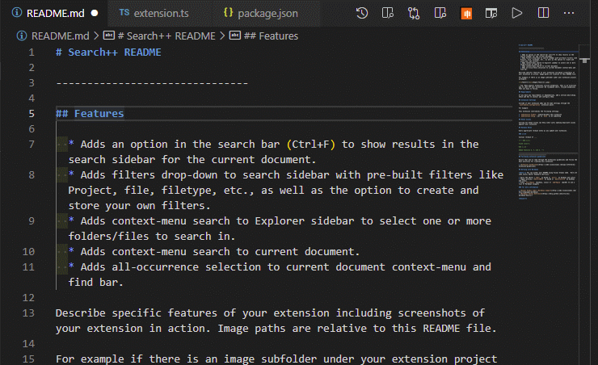

# Search++

## Features

## Planned Features

  * Adds an option in the search actionbar (`Ctrl+F`)<!-- TODO: See if there's a way to detect user keybindings and populate appropriate README.md fields.--> to show results in the sidebar's search view (`Ctrl+Shift+F`) for the current document.
  * Adds filters drop-down to sidebar's search view with pre-built filters like Project, file, filetype, etc., as well as the option to create custom filters and store them in settings.
  * Adds context-menu search to sidebar's Explorer view to select one or more folders/files to apply a filter for a search in.
  * Adds context-menu search to current document.
  * Adds (`Select Next Occurrence`, <!-- Ctrl+D --> `Deselect Occurrence`, <!-- Ctrl+U --> and `Select All Occurrences` <!-- Ctrl+Shift+L -->) to current document context-menu and (`Find`) actionbar.
  * Adds option to select multiple occurrences (within one document) via the multi-select modifier (Ctrl/Cmd/Alt) from the sidebar's search view. <!-- TODO: upon holding the multiple selection modifier, visibly and programmatically disable clicking on search occurrences in other documents.-->

<!-- Describe specific features of your extension including screenshots of your extension in action. Image paths are relative to this README file.

For example if there is an image subfolder under your extension project workspace: -->

<!-- > Tip: Many popular extensions utilize animations. This is an excellent way to show off your extension! We recommend short, focused animations that are easy to follow. -->

<!-- ## Requirements

If you have any requirements or dependencies, add a section describing those and how to install and configure them. -->

## Extension Settings

<!-- Include if your extension adds any VS Code settings through the `contributes.configuration` extension point.

For example: -->

This extension contributes the following settings:

* `searchpp.view.searchSidebar`: On the (`Find`) command (Ctrl+F), opens the sidebar's search view filtered to the current editor.
* `searchpp.filters`: an array of default and custom filters that populate the drop-down menu in the sidebar's search view.
* `searchpp.explorer.keepFilters`: Stores the filter for the selected folders and files when using the (`Find`) action in the sidebar's explorer view. <!-- TODO: Choose between Always, Smart, and Never, where Smart is described as ignoring filters with only one element, i.e., only searching for something in one file. -->
<!-- * `searchpp.` -->

## Known Issues

Selecting multiple occurrences only works in one document opened in the sidebar's search view. There are synchronization, loading, and editing issues that need to be addressed for this issue to be overcome.

## Release Notes

Users appreciate release notes as you update your extension.

### 1.0.0

Initial release of ...

<!-- ### 1.0.1

Fixed issue #.

### 1.1.0

Added features X, Y, and Z. -->

-----------------------------------------------------------------------------------------------------------
<!-- ## Following extension guidelines

Ensure that you've read through the extensions guidelines and follow the best practices for creating your extension.

* [Extension Guidelines](https://code.visualstudio.com/api/references/extension-guidelines)

## Working with Markdown

**Note:** You can author your README using Visual Studio Code.  Here are some useful editor keyboard shortcuts:

* Split the editor (`Ctrl+\`)
* Open new preview (`Shift+Ctrl+V`)
* Press `Ctrl+Space` to see a list of Markdown snippets

### For more information

* [Visual Studio Code's Markdown Support](http://code.visualstudio.com/docs/languages/markdown)
* [Markdown Syntax Reference](https://help.github.com/articles/markdown-basics/)

**Enjoy!** -->
